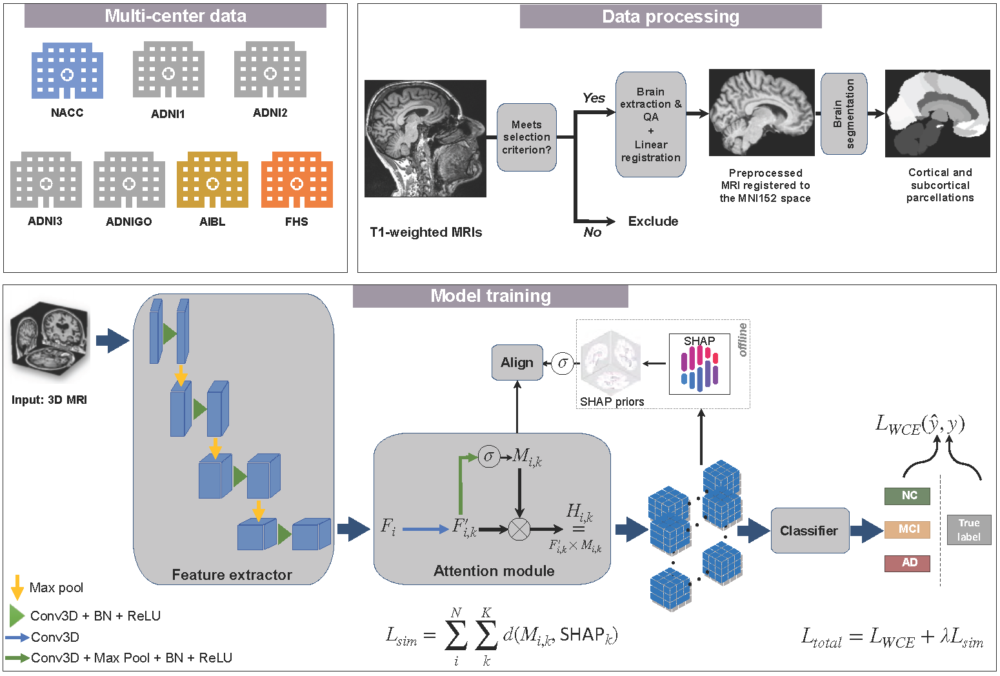

# Disease-driven Domain Generalization (D3G) for neuroimaging-based assessment of Alzheimer's disease
### <i>Diala Lteif, Sandeep Sreerama, Sarah A. Bargal, Bryan A. Plummer, Rhoda Au, and Vijaya B. Kolachalama, Senior Member, IEEE</i>

## Introduction

This repository contains the implementation of a deep learning framework that uses disease-informed prior knowledge to train generalizable models for the classification of Alzheimer's disease. We train of persons with normal cognition (NC), mild cognitive impairment (MCI), and Alzheimer's disease (AD).

We trained a deep neural network that used model-identified regions of disease relevance to inform model training. We trained a classifier to distinguish persons with normal cognition (NC) from those with mild cognitive impairment (MCI) and Alzheimer's disease (AD) by aligning class-wise attention with a unified visual saliency prior computed offline per class over all training data. We demonstrated that our proposed method competes with state-of-the-art methods with improved correlation with postmortem histology, thus grounding our findings with gold standard evidence and paving a way towards validating DG frameworks.




### Prerequisites

The tool was developed using the following dependencies:

1. PyTorch (1.13 or greater).
2. TorchIO (0.18 or greater).
3. MONAI (0.8 or greater).
3. NumPy (1.19 or greater).
3. tqdm (4.62 or greater).
4. pandas (1.1 or greater).
4. nibabel (3.2 or greater).
5. nilearn (0.8 or greater).
5. matplotlib (3.3 or greater).
6. shap (0.39 or greater).
7. scikit-learn (0.24 or greater).
8. scipy (1.5.4 or greater).

### Installation
You can clone this repository using the following command:
```bash
git clone https://github.com/vkola-lab/d3g.git
```


## Documentation

You can train, validate, and test your model using the bash scripts we provided under ```codebase/DeepDG/scripts```.

The training pipeline consists of the following steps...

